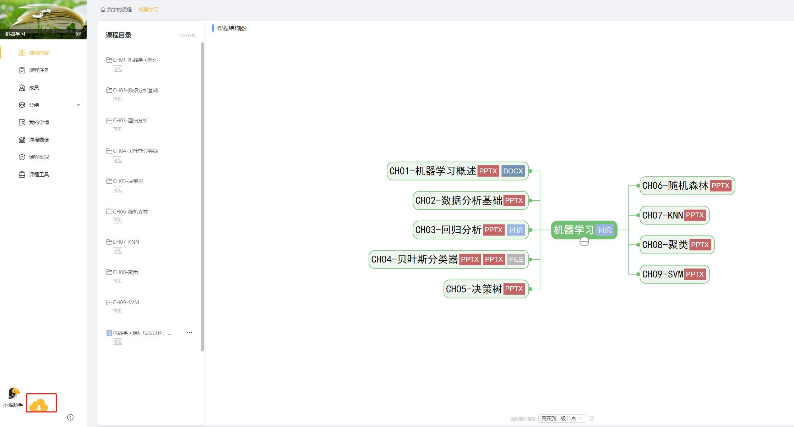
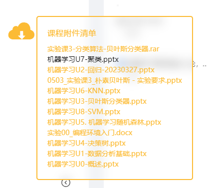

## 公开脚本
记录日常开发的脚本工具

-----

1. 小雅智能教学平台课件[下载工具](./xy_downloader.js)，以Tampermonkey插件脚本的形式完成功能。可以通过[greasyfork](https://greasyfork.org/scripts/463259)安装该插件。
插件使用方法如下：
    - 进入课程页面
    - 点击左下角下载按钮
    
    - 在课程附件清单中，通过点击下载需要的课件
    

